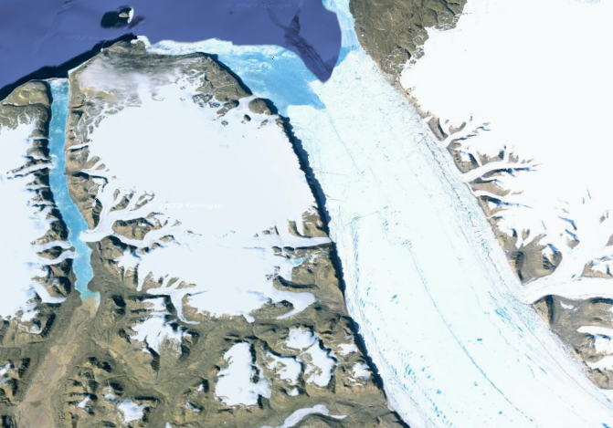

## Activity 2.2 - Activity 2.2 – Cyrosphere

---

## Petermann Glacier, Greenland - 1999 to 2022

The Petermann Glacier is a large glacier located on the northern shores of Greenland. 
Satellite images captured over the last 20 years shows the changes that have taken place.

## Problem

The Petermann Glacier is one of Greenland's largest marine-terminating glaciers, meaning the terminus of the glacier comes into
direct contact with the ocean. 
Satellite imagery from US Geological Service(USGS), show that since 1999 the glacier has been receding further back.
This is caused by ice breaking off of the glacier and floating into the ocean, this act referred to as calving.
Calving is a normal process of glaciers, however when the rate of calving exceeds the rate that the glacier is recharged, 
geologists are left to determined if the acceleration is caused by global warming, and what the affects that might have.

## Explanation

Over the last decade, Petermann Glacier has lost 40% of its ice shelf (Åkesson et al, 2022). 
A concern over this loss is that it could lead to an acceleration of loss of ice on the glacier. 
In a model used in Åkesson's article, they discuss different conditions that might reverse the current trend and recover the lost
mass of the glacier. 
In the model, they first looked at reduced ocean temperatures for re-establishing the ice shelfs, however even with the cooler
ocean the ice does not recover to it's pre-2010 level. 
Another method of recovery that was looked into was questioning whether a reduction in calving could assist in the glaciers recovery.
Åkesson's team found that even a reduction in calving, that alone was not enough to induce a recovery.
So then it would seem that in order to there would need to be both a reduction in ocean temperatures and a reduction in calving.
The Paris Agreement's aim to reduce global temperature may be a step in curbing the loss of these glaciers and staving off rising
oceans, but as the models that were run show, there may be more changes needed to ensure the stabilization of these glaciers.

Petermann Glacier, Greenland, 1999

Petermann Glacier, Greenland, 2014

Petermann Glacier, Greenland, 2022

)

Petermann Glacier, Greenland via Google Earth

### References
USGS, Petermann Glacier, Greenland, [https://eros.usgs.gov/media-gallery/earthshot/petermann-glacier-greenland](https://eros.usgs.gov/media-gallery/earthshot/petermann-glacier-greenland)

Google Earth, Petermanm Glacier, Greenland. Retrieved from [earth.google.com](https://earth.google.com/web/search/Petermann+Glacier,+Greenland/@80.68959041,-60.57749316,37.08243018a,231035.75818375d,35y,-1.33366157h,46.46498082t,0r/data=CocBGl0SVwolMHg0ZmM4M2M4YTJhY2RjZjJkOjB4ZWJkMGM1NmUwNDA3OTg0MhkAAAAAACBUQCGUv9YAAMBNwCocUGV0ZXJtYW5uIEdsYWNpZXIsIEdyZWVubGFuZBgBIAEiJgokCcFjFJNNej1AEU-u8dsjdz1AGQYGOFYrrFjAIS3cX975rVjA)

Åkesson, H., Morlighem, M., Nilsson, J. et al. Petermann ice shelf may not recover after a future breakup. Nat Commun 13, 2519 (2022). https://doi.org/10.1038/s41467-022-29529-5
